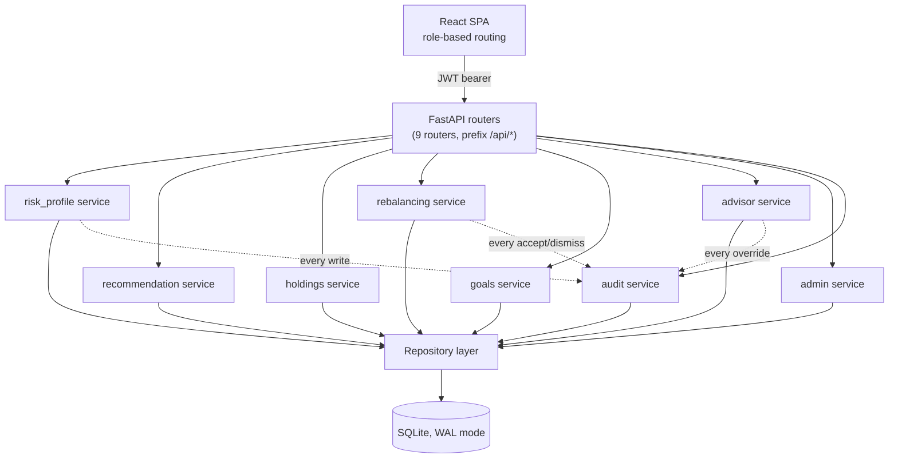
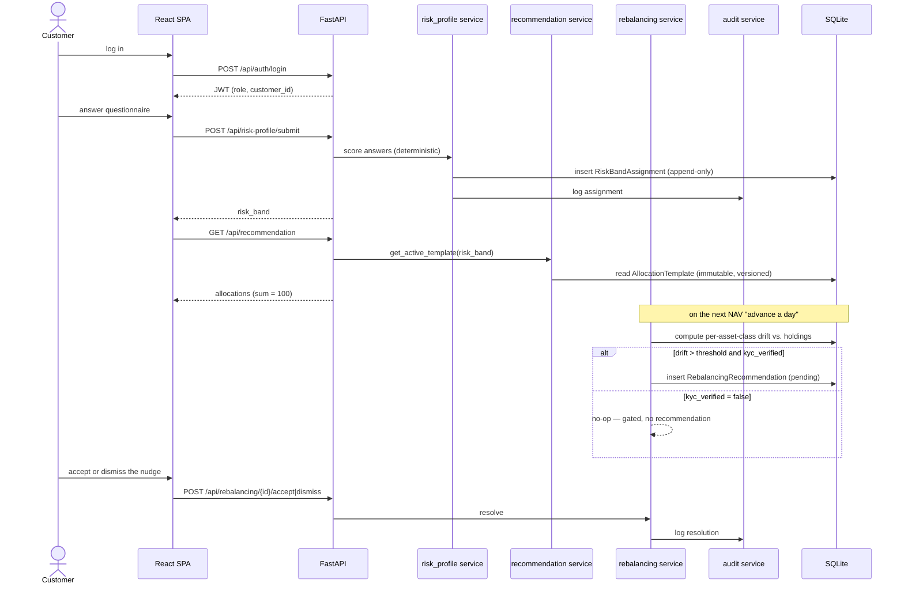

# WealthWise

**Robo-Advisory & Portfolio Recommendation Platform** — deterministic, rule-based risk profiling, portfolio allocation, drift detection, and rebalancing for retail investors.

Built for BFS Wealth Management (Business Case **BC-AINE-008**) as an AI-Native Engineering capstone: **all production code, tests, and migrations are agent-generated** under human supervision, with specs as the source of truth. No machine learning is used anywhere — every recommendation is deterministic and rule-based.

Status: **207/207 features passing**, merged to `main`.

---

## Table of contents

- [What it does](#what-it-does)
- [Who uses it](#who-uses-it)
- [Architecture](#architecture)
- [Data flow](#data-flow)
- [Data model](#data-model)
- [API surface](#api-surface)
- [Tech stack](#tech-stack)
- [Running it](#running-it)
- [Testing](#testing)
- [Project conventions](#project-conventions)
- [Repo layout](#repo-layout)

---

## What it does

A customer answers a risk-profile questionnaire and gets a deterministic risk band (`CONSERVATIVE` / `MODERATE` / `AGGRESSIVE`), a recommended asset allocation for that band (always summing to exactly 100%), goal tracking with progress snapshots, holdings/drift monitoring, and rebalancing nudges they can accept or dismiss. An advisor can drill into any customer, override their risk band with a reason, or log a manual recommendation. An admin publishes new versions of the scoring rules and allocation templates (both immutable once published — in-flight customers stay pinned to the version active when they were assigned). A compliance/auditor role gets a read-only, filterable audit trail of every risk-band assignment, recommendation, rebalancing action, and override.

## Who uses it

| Persona | Can do |
|---|---|
| **Customer** | Complete the risk questionnaire, view recommended allocation, manage goals, view holdings/drift, accept or dismiss rebalancing recommendations |
| **Advisor** | View a customer list, drill into a customer's portfolio, override their risk band (audited), log a manual recommendation |
| **Admin** | Edit the risk-band scoring rules and questionnaire, publish new allocation-template versions (live sum-to-100 validation), manage the asset-class master, manage the rebalancing drift threshold |
| **Compliance / Auditor** | Read-only audit log, filterable by actor, entity type, and date range |

All four roles authenticate through one JWT login; there is no self-registration — only seeded demo accounts exist.

## Architecture

Strict layered architecture, one-way dependencies only:

```
Types → Config → Repository → Service → API → UI
```

A layer may import from any layer below it, never from one above. Enforced by an architecture-check hook on every save. See [`.claude/architecture.md`](.claude/architecture.md) for the full rule set.



Every domain write (risk-band assignment, advisor override, rebalancing accept/dismiss) calls the audit service exactly once — that's the append-only trail compliance reads. Backend domain modules live under `backend/src/domain/`: `risk_profile/`, `recommendation/`, `holdings/`, `rebalancing/`, `goals/`, `advisor/`, `admin/`, `audit/`, `auth/`.

## Data flow

A customer's full path from signup to a rebalancing nudge — one login, one questionnaire, one recommendation, one drift check:



## Data model

14 entities, three of them insert-only / append-only by design (NFR-02, NFR-05):

| Entity | Notes |
|---|---|
| `User` | `role` ∈ {customer, advisor, admin, compliance} |
| `Customer` | `kyc_verified` bool (default true) — the one real gating branch: `false` blocks rebalancing recommendations |
| `RiskProfileAnswer` | **append-only** |
| `RiskBandRule` | **insert-only**, immutable once published — questionnaire + scoring, versioned |
| `RiskBandAssignment` | **append-only** — one row per submission, never mutated |
| `AllocationTemplate` | **insert-only**, immutable once published — allocations always sum to exactly 100 |
| `Goal` | target_amount, target_date, priority — multiple per customer |
| `GoalProgressSnapshot` | one per NAV refresh |
| `AssetClass` | master data |
| `NavSnapshot` | seed CSV + manual "advance a day" endpoint (no wall-clock scheduler) |
| `Holding` | current_value per customer per asset class |
| `RebalancingRecommendation` | **append-only**, status ∈ {pending, accepted, dismissed} |
| `AdvisorOverride` | **append-only**, audited |
| `AuditLogEntry` | write-once, feeds the compliance screen |

Full field-level detail: [`specs/brd/brd.md`](specs/brd/brd.md) §9.

## API surface

All routes are JWT-protected (`Authorization: Bearer <token>`) except `/health` and `POST /api/auth/login`; role enforcement happens at one place — `require_role()` in `backend/src/app/dependencies.py`.

| Router | Method | Path | Role |
|---|---|---|---|
| auth | POST | `/api/auth/login` | none |
| auth | GET | `/api/auth/me` | any authenticated |
| risk-profile | GET | `/api/risk-profile/questionnaire` | customer |
| risk-profile | POST | `/api/risk-profile/submit` | customer |
| risk-profile | GET | `/api/risk-profile/latest` | customer |
| recommendation | GET | `/api/recommendation` | customer |
| holdings | GET | `/api/holdings` | customer |
| goals | POST / GET | `/api/goals` | customer |
| goals | PATCH | `/api/goals/{goal_id}` | customer |
| goals | GET | `/api/goals/{goal_id}/progress` | customer |
| rebalancing | GET | `/api/rebalancing` | customer |
| rebalancing | POST | `/api/rebalancing/{id}/accept` | customer |
| rebalancing | POST | `/api/rebalancing/{id}/dismiss` | customer |
| advisor | GET | `/api/advisor/customers` | advisor |
| advisor | GET | `/api/advisor/customers/{id}` | advisor |
| advisor | POST | `/api/advisor/customers/{id}/override` | advisor |
| advisor | POST | `/api/advisor/customers/{id}/manual-recommendation` | advisor |
| admin | POST / GET | `/api/admin/risk-band-rules` | admin |
| admin | POST / GET | `/api/admin/allocation-templates` | admin |
| admin | POST / GET | `/api/admin/asset-classes` | admin |
| admin | POST | `/api/admin/advance-day` | admin |
| audit | GET | `/api/audit` | compliance |
| health | GET | `/health` | none |

Interactive docs at `http://localhost:8000/docs` once the backend is running.

## Tech stack

| Layer | Choice |
|---|---|
| Backend | Python 3.12, FastAPI, `uv`, `ruff`, `mypy`, `pytest`, SQLAlchemy + Alembic, SQLite (WAL mode) |
| Frontend | TypeScript, React, Vite, `npm`, `eslint`, `tsc`, `vitest` |
| Auth | JWT (bcrypt-hashed passwords, role claim in token), seeded demo accounts only — no self-registration |
| Money/percentages | Fixed-point/`Decimal` everywhere — never floating-point (NFR-01) |
| Deployment | Local dev servers only (no Docker, no production target) |

## Running it

**One command**, from the repo root:

```bash
bash init.sh
```

This installs backend + frontend dependencies, exports the required env vars (generating a `JWT_SECRET` if you haven't set one — see `backend/.env.example` for the full list), runs migrations and the idempotent seed, and starts both dev servers with health checks. Needs `uv`, `npm`, `curl`, and `openssl` on `PATH`.

- Backend: `http://localhost:8000` (docs at `/docs`)
- Frontend: `http://localhost:5173`
- Demo accounts: `backend/seed/demo_accounts.json`, password `WealthWise-Demo-Synthetic-2026!` for every seeded account

**Manually, two terminals**, if you'd rather run them yourself:

```bash
# terminal 1 — backend
cd backend
export DATABASE_URL="sqlite:///./wealthwise.db"
export JWT_SECRET="<generate with: openssl rand -hex 32>"
uv run alembic upgrade head   # first run only — idempotent
uv run uvicorn src.app.main:app --host 0.0.0.0 --port 8000   # no --reload

# terminal 2 — frontend
cd frontend
npm run dev
```

`DATABASE_URL`/`JWT_SECRET` must be real environment variables, not a `backend/.env` file — the test suite asserts none exists on disk (synthetic-data / secrets hygiene).

## Testing

```bash
# backend
cd backend && uv run pytest -x -q          # 664 tests, 100% coverage
uv run ruff check --fix .
uv run mypy src/

# frontend
cd frontend && npm test                     # 144 tests
npm run lint
npm run typecheck
```

## Project conventions

- **TDD mandatory** — test first, then implement.
- **No hand-coding** — production code, tests, and migrations are agent-generated only. Hand-edits are limited to specs, `CLAUDE.md`, agent definitions, hooks, and skills.
- **Spec is truth** — a spec/code disagreement is resolved by updating the spec and regenerating the code, not patching around it.
- **PR-only merge** — no direct commits to `main`.
- **Synthetic data only** — no real or confidential data anywhere.
- **Immutable, versioned rules** — risk-band rules and allocation templates are insert-only and append-only once published (NFR-05); allocation percentages always sum to exactly 100 (NFR-08).
- **No floating-point money** — fixed-point arithmetic everywhere money or a percentage is involved (NFR-01).
- **No PII/financial data in logs** (NFR-03).

Full pipeline (`/brd` → `/spec` → `/design` → `/build` → `/evaluate` → `/review` → `/test` → `/deploy`), quality rubric, and session-recovery process are documented in [`CLAUDE.md`](CLAUDE.md) and `.claude/skills/`.

## Repo layout

```
backend/
  src/
    types/        # Layer 1 — domain models, enums, fixed-point helpers
    core/          # Layer 2 — config, security, logging, clock
    db/            # Layer 3 — SQLAlchemy models, session, migrations, seed
    domain/        # Layer 4 — business logic per module (risk_profile, recommendation, ...)
    app/           # Layer 5 — FastAPI routers, dependencies, middleware
  tests/           # unit, repository, api, architecture tests
  alembic/         # append-only migrations
  seed/            # demo accounts + asset-class/NAV seed CSVs
frontend/
  src/
    types/         # mirrors backend entity types
    api/           # typed HTTP client per domain
    pages/         # per-persona screens (customer/, advisor/, admin/, compliance/)
    components/    # shared UI (NavBar, DataTable, Modal, ...)
specs/             # BRD, stories, design docs, evaluator reports, feature list
sprint-contracts/  # per-group evaluation contracts (A–H)
.claude/           # architecture rules, skills, agent defs, hooks
init.sh            # one-command local bootstrap
```

---

🤖 Built with [Claude Code](https://claude.com/claude-code).
