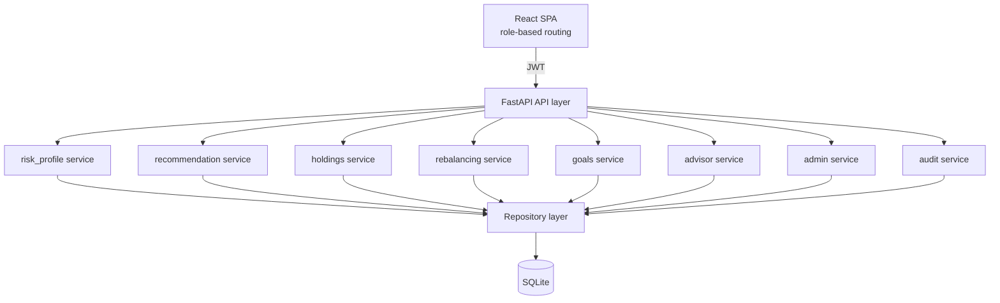

# Business Requirements Document — WealthWise

**Robo-Advisory & Portfolio Recommendation Platform**
Business Case BC-AINE-008 | Domain: BFS — Wealth Management
Status: Drafted via `/brd` Socratic interview, pending human approval to proceed to `/spec`
Date: 2026-09-03

---

## 1. Executive Summary

WealthWise is a deterministic, rule-based robo-advisory platform for retail investors. It provides self-service risk profiling, portfolio allocation recommendations, goal tracking, holdings/drift monitoring, and rebalancing nudges, alongside an advisor override workflow, an admin console for versioned rule/template management, and a compliance audit trail. No machine learning is used — all recommendation logic is deterministic and rule-based. The system is built as an AI-Native Engineering capstone: all production code, tests, and migrations are generated by Claude Code agents under human supervision, with specs as the source of truth.

The platform is architected as a single modular monolith (FastAPI + React + SQLite), scoped to a 20-hour build budget, evaluated against a 100-mark rubric spanning specs/agent substrate, business understanding, architectural discipline, technical implementation, and CI/CD.

## 2. Problem Statement

A wealth-management firm wants to launch self-service robo-advisory for retail investors but currently has no digital self-service offering. Without one, the firm risks losing retail assets under management (AUM) to established digital robo-advisors (e.g., Betterment, Wealthfront) that already offer automated risk profiling, goal-based investing, and rebalancing. This is a simulated business narrative for the capstone — no real firm, real customers, or real financial data are involved (Synthetic-Data Rule).

The platform must deliver: customer risk profiling, rule-driven portfolio recommendation, goal tracking, and rebalancing nudges — built entirely by Claude Code agents under human supervision (No-Hand-Coding Rule), with specs as the arbiter of truth (Spec-Is-Truth Rule) and all changes merged via reviewed pull requests (PR-Only-Merge Rule).

## 3. Target Users

Four personas, role-separated at the controller layer (NFR-04):

| Persona | Description | Primary needs |
|---|---|---|
| **Customer** | Retail investor, self-service, low-to-moderate financial/technical sophistication | Understand risk tolerance, see a recommended allocation, set financial goals, track goal progress, act on rebalancing nudges |
| **Advisor** | Internal firm staff supporting customers | View customer portfolios, override an automated risk-band assignment with justification, log manual recommendations |
| **Admin** | Internal firm staff governing the rules engine | Edit risk-band scoring rules and the questionnaire, publish new versioned allocation templates, manage the asset-class master |
| **Compliance/Auditor** | Internal oversight role | Read-only visibility into the append-only audit trail (risk-band assignments, recommendations, rebalancing actions, advisor overrides) |

## 4. Success Metrics

This is an academic capstone with simulated business context rather than live users, so success is measured exclusively against the grading rubric (no additional product KPIs):

- **Distinction:** score ≥ 90 / 100
- **Merit:** score 75–89 / 100
- **Pass:** score 60–74 / 100
- **Not Yet Passed:** score < 60 / 100

Rubric categories: Claude Code Specs (40), Business Understanding (20), Architectural Discipline (8), Technical Implementation (26), CI/CD (6). All 10 functional acceptance criteria (AC-01 through AC-10) must be implemented and test-covered; ≥80% coverage floor; every spec AC traceable to at least one test.

**Cost of not solving:** Simulated framing — without a self-service digital offering, the firm's retail AUM erodes to competitors offering automated risk profiling and goal-based investing. For grading purposes, the direct cost of not meeting the rubric bar is a "Not Yet Passed" outcome.

## 5. Scope

### 5.1 In Scope

**Customer capabilities:**
- Complete a ≥6-question risk-profile questionnaire; receive a deterministic risk band (CONSERVATIVE / MODERATE / AGGRESSIVE) — AC-01
- View a recommended asset allocation for their risk band and goal horizon, allocations always summing to 100 — AC-02, AC-04
- Create and manage multiple financial goals (target_amount, target_date, priority) — AC-03
- View current holdings and per-asset-class allocation drift — AC-05
- Receive rebalancing recommendations (BUY/SELL quantities) when drift exceeds a configured threshold; accept or dismiss with audit — AC-06, AC-07
- View goal progress (percent_complete), recomputed on each NAV refresh — AC-08

**Advisor capabilities:**
- View a customer's portfolio (drill-in from a customer list)
- Override a customer's risk band with a reason and supporting note, fully audited — AC-09
- Log a manual recommendation (via a modal/panel on the customer drill-in view, not a standalone screen)

**Admin capabilities:**
- Edit risk-band scoring rules and the risk-profile questionnaire; publish new immutable versions
- Manage the asset-class master
- Publish new versioned allocation templates per risk band, with live sum-to-100 validation; published versions are immutable, in-flight customers stay pinned to the version active at assignment time — AC-10

**Compliance/Auditor capabilities:**
- Dedicated, read-only audit-log screen, filterable by actor, entity type, and date range

**System/internal:**
- Asset price feed stub: seed CSV loaded at startup, plus a manual admin/dev "advance a day" endpoint that triggers NAV refresh (no wall-clock scheduler)
- Rebalancing engine: detects drift > configured threshold (default 5%, versioned alongside allocation rules), proposes BUY/SELL quantities
- Goal tracker: recomputes and snapshots progress on each NAV refresh
- `kyc_verified` boolean stub on Customer (default `true` for seed data, no verification flow, no dedicated UI) — wired into exactly one real gating branch: a customer with `kyc_verified = false` cannot receive a rebalancing recommendation

### 5.2 Out of Scope

- Real exchange or brokerage integration
- Real-time market data (stubbed daily NAV only)
- Multi-currency or FX
- Tax-loss harvesting and tax optimization
- Real KYC document workflow (stub flag only, no verification flow)
- Machine-learning-based recommendation (rule-based only)
- Production deployment, secret management, multi-region
- External notification channels (email/SMS) — all "notification" is a synchronous API error/success response plus an audit-log entry where applicable
- Formal WCAG-certified accessibility audit
- Custom visual branding/design system
- Uptime SLAs, rate limiting, or cost/budget constraints beyond the 20-hour build window

### 5.3 Future Considerations (explicitly out of scope for v1)

- Two-service split (customer-facing vs. back-office API) for real network-level role isolation
- File-based, git-tracked policy engine for rules/templates (rejected in favor of DB-versioned rows so Admin can publish live)
- In-app toast/notification UI layer
- Full responsive coverage across all screens (v1 demonstrates one responsive breakpoint on the customer dashboard only)

## 6. MVP Definition

All 10 ACs are mandatory by the end of the build (the rubric requires test coverage for each), but delivery is sequenced into three sprint groups per the harness's ratchet model:

1. **Sprint 1 — Risk Profile + Recommendation:** AC-01, AC-02, AC-03, AC-04 (questionnaire, risk-band scoring, goal creation, allocation recommendation)
2. **Sprint 2 — Holdings + Drift:** AC-05 (holdings tracking, per-asset-class drift calculation)
3. **Sprint 3 — Rebalancing + Goal Tracker + Advisor Override + Admin Template Versioning:** AC-06, AC-07, AC-08, AC-09, AC-10

The true MVP (smallest deployable slice delivering real value) is Sprint 1: a customer can determine their risk band and see a recommended allocation. Sprints 2 and 3 are required for a complete submission but are explicitly sequenced after Sprint 1.

## 7. Alternatives Considered

Three architectural approaches were evaluated (Dimension 2.5 of the BRD interview):

| Option | Description | Verdict |
|---|---|---|
| **A — Single modular monolith, DB-versioned rules (chosen)** | One FastAPI app, layered `Types → Config → Repository → Service → API`, domain modules under `src/domain/` (risk_profile, recommendation, holdings, rebalancing, goals, advisor, admin, audit). Insert-only versioned DB tables for risk-band rules and allocation templates. One React app, role-based routing. | **Selected.** Fits the 20-hour budget, matches `project-manifest.json`'s single backend/frontend assumption, lets Admin publish new rule/template versions through a live UI backed by a simple insert, and is directly enforceable by the harness's `check-architecture.js` layering hook. |
| **B — Two-service split (Customer API vs. Back-Office API)** | Separate FastAPI apps for customer-facing vs. internal (advisor/admin/compliance) traffic, sharing a domain library. | **Rejected.** Mirrors a real production security boundary but doubles setup/CI/deploy surface for no rubric benefit, and conflicts with the manifest's single `api_base_url`/health check — too high risk for the time budget. |
| **C — File-based versioned policy engine (rules-as-code)** | Risk-band rules and allocation templates as versioned JSON files under `policies/`, git-tracked and immutable by convention; DB stores only a version pointer. | **Rejected.** Immutability is elegant via git history, but directly conflicts with the Admin persona's requirement to publish new rule/template versions from a *live running app* — writing files at runtime and keeping them in sync with the DB adds complexity with no clear benefit over Option A's insert-only tables. |

**Rationale for A:** The manifest already commits to one backend, one frontend, one SQLite DB, and local-dev-only deployment. Admin needs a genuine live-publish workflow for rules/templates, which insert-only DB tables satisfy directly. The harness's layered-architecture enforcement (`check-architecture.js`) maps cleanly onto Option A's module structure.

## 8. Technical Architecture

**Stack** (fixed by `project-manifest.json`, not renegotiated during this interview):

| Layer | Choice |
|---|---|
| Backend | Python 3.12, FastAPI, `uv` (package mgmt), `ruff` (lint), `mypy` (typecheck), `pytest` (tests) |
| Frontend | TypeScript, React, Vite, `npm`, `eslint`, `tsc`, `vitest` |
| Database | SQLite (single instance, no secondary store) |
| Deployment | Local dev servers only — `uv run uvicorn app.main:app --reload` (backend), `npm run dev` (frontend); no Docker/production deployment |
| Auth | JWT, seeded demo accounts, bcrypt-hashed passwords, role claim in token, no self-registration flow |
| CI | GitLab CI (`.gitlab-ci.yml`) only, with Claude Code Action wired into the pipeline |

**Architecture pattern:** Single modular monolith, strictly layered `Types → Config → Repository → Service → API → UI`, one-way dependencies enforced by the `check-architecture` hook. Backend domain modules under `src/domain/`: `risk_profile/`, `recommendation/`, `holdings/`, `rebalancing/`, `goals/`, `advisor/`, `admin/`, `audit/`.

**External integrations:** None. Asset price feed is a fully self-contained stub (seed CSV at startup + manual "advance a day" endpoint). No real market data, brokerage, or payment APIs.

**Performance/scale:** No explicit SLA. NFR-07 requires the health endpoint to return 200 within 1 second of successful startup. No concurrency/load targets — this is a local-dev, single-evaluator capstone, not a production system.

**Non-functional requirements carried from the capstone brief:**
- NFR-01: Fixed-point arithmetic only for money/percentages/drift — never floating-point
- NFR-02: Risk-band assignments, recommendations, rebalancing actions, overrides — append-only
- NFR-03: Customer PII and financial-position data never written to logs
- NFR-04: Authentication boundary at controller layer; customer/advisor/admin/compliance roles separated
- NFR-05: Database, policy, and template migrations are append-only
- NFR-06: Structured JSON logs with request correlation IDs
- NFR-07: Health endpoint returns 200 within 1 second of successful startup
- NFR-08: Architecture rules enforced as tests — allocation percentages must sum to 100; published templates cannot be mutated; risk-band reassignment requires an override audit record

## 9. Data Model Overview

| Entity | Key fields | Notes |
|---|---|---|
| `User` | id, email, password_hash, role | role ∈ {customer, advisor, admin, compliance}; flat field, no separate Advisor/Admin profile tables |
| `Customer` | id, user_id, kyc_verified (bool, default true) | |
| `RiskProfileAnswer` | id, customer_id, question_id, answer_value, submitted_at | Append-only |
| `RiskBandAssignment` | id, customer_id, risk_band, rule_version, assigned_at | Append-only (NFR-02) |
| `RiskBandRule` | id, version, questionnaire_json, scoring_rules_json, published_at, is_active | Insert-only, immutable once published (AC-10) |
| `AllocationTemplate` | id, version, risk_band, allocations_json, published_at, is_active | Insert-only, immutable once published; allocations sum to 100 (AC-02, AC-10) |
| `Goal` | id, customer_id, target_amount, target_date, priority, created_at | Multiple per customer (AC-03) |
| `GoalProgressSnapshot` | id, goal_id, current_value, percent_complete, snapshot_at | Append-only, one per NAV refresh (AC-08) |
| `AssetClass` | id, code, name | Master data |
| `NavSnapshot` | id, asset_class_id, price_date, nav_value | Seed CSV + "advance a day" trigger |
| `Holding` | id, customer_id, asset_class_id, current_value, as_of_date | |
| `RebalancingRecommendation` | id, customer_id, recommendation_id, proposed_actions_json, status, generated_at, resolved_at | Append-only (AC-06, AC-07); status ∈ {pending, accepted, dismissed} |
| `AdvisorOverride` | id, customer_id, advisor_id, previous_band, new_band, reason, note, created_at | Append-only, audited (AC-09) |
| `AuditLogEntry` | id, entity_type, entity_id, actor_id, actor_role, action, timestamp, details_json | Feeds Compliance/Auditor screen (NFR-02) |

**Seed data volumes:** 8–10 customers spanning all 3 risk bands, 5–6 asset classes, 2 allocation-template versions per risk band, 2 advisors, 1 admin, 1 compliance user.

## 10. External Integrations

None. The system is fully self-contained for the capstone scope:
- No real market-data provider
- No real brokerage/exchange
- No payment processor
- No email/SMS provider
- Asset price feed is a local stub (seed CSV + manually triggered "advance a day" endpoint)

## 11. Edge Cases & Constraints

| Scenario | Behavior |
|---|---|
| Admin publishes an allocation template whose percentages don't sum to 100 | Rejected at the API boundary with `422`; nothing written. Enforced as both a domain invariant and an architecture test (NFR-08). |
| Two admins attempt to publish a new version for the same risk band concurrently | DB-level uniqueness/monotonic version constraint rejects the second write with `409 Conflict`; no silent overwrite (protects AC-10 immutability). |
| Customer submits an incomplete risk-profile questionnaire | Rejected with `422`; no partial risk-band assignment is created. |
| Rebalancing engine runs for a customer with zero holdings | No-op — no recommendation generated, not an error. |
| Customer has `kyc_verified = false` | Blocked from receiving rebalancing recommendations (the one real gating branch for this stub flag). |
| Any of the above / general error handling | No external notification channel exists — all "notification" is a synchronous API error response plus (where applicable) an `AuditLogEntry`. No in-app toast layer required. |

**Compliance/regulatory framing:** `docs/business-case.md` will include an illustrative, explicitly non-certified simulated regulatory posture — a suitability-style rationale for why risk banding drives allocation, and a simulated PII-handling posture consistent with NFR-03. This is framed as illustrative domain reasoning, not a real compliance claim, since the system uses only synthetic data (Synthetic-Data Rule).

**Operational constraints:** No uptime SLA, no rate limiting, no cost/budget constraint beyond the 20-hour build window. "Failure modes" for this project are code-review-relevant domain edge cases — version races, fixed-point rounding at drift boundaries, double-triggering the "advance a day" endpoint on the same day, an advisor override racing a fresh risk-band recompute — not live-production incident/alerting scenarios.

## 12. UI Context

Single React SPA, role-based routing after JWT login. Minimal visual design (plain CSS, neutral palette, no custom design system or branding effort — visual polish is explicitly not evaluated by the rubric). Desktop-first; one screen (the customer dashboard) demonstrates a responsive breakpoint down to tablet/mobile width — full responsive coverage is not required. Accessibility baseline: semantic HTML, keyboard-navigable forms, labeled inputs — no formal WCAG audit or certified target level.

| Persona | Screens |
|---|---|
| Shared | Login (JWT, role-based redirect) |
| Customer | Risk-profile questionnaire → risk-band result; Goals list + create/edit; Recommended allocation view; Holdings + drift view; Rebalancing recommendations list (accept/dismiss) |
| Advisor | Customer portfolio view (list → drill-in); Risk-band override form (reason + note); Manual-recommendation log — modal/panel on the customer drill-in view (not a standalone screen) |
| Admin | Risk-band rule editor (questionnaire + scoring, publish new version); Allocation template editor (per risk band, live sum-to-100 validation, publish new version); Asset-class master management |
| Compliance/Auditor | Dedicated audit-log screen — filterable by actor, entity type, date range; read-only |

## 13. Open Questions

The following implementation-level details are intentionally deferred to `/spec` (per-feature specs) rather than resolved at the BRD level, since they are design decisions within the already-confirmed business rules, not open business requirements:

- Exact content of the ≥6-question risk-profile questionnaire and point-scoring thresholds mapping to CONSERVATIVE/MODERATE/AGGRESSIVE bands. The BRD requirement is that scoring is deterministic, versioned, and rule-based — the literal question set is a `risk-profile_spec.md` decision.
- Exact default rebalancing drift threshold value and where it is versioned/configured (assumed default 5%, versioned alongside allocation rules, editable by Admin — to be confirmed structurally at `/design`).
- JWT access-token expiry duration and refresh-token strategy (assumed a standard short-lived access token; no refresh-token requirement was raised — confirm at `/design` if session length matters).
- Database migration tooling for SQLite under FastAPI (e.g., Alembic) to satisfy NFR-05's append-only migration requirement — not specified by the human, assumed as a standard choice at `/design`.
- Exact wording/fields of the "log a manual recommendation" modal on the Advisor's customer drill-in view.

---

*This BRD was produced via the `/brd` Socratic interview across five dimensions (Why, What, Alternatives, How, Edge Cases, UI Context), each confirmed with the coordinator before synthesis. It reflects the WealthWise capstone brief (`AI_Native_Engineer_capstone_Project.md.md`) and the pre-existing `project-manifest.json` stack commitments, extended with human decisions on personas, sprint sequencing, architecture option, data model, auth, seed volumes, CI target, edge-case behavior, compliance framing, and UI scope.*
