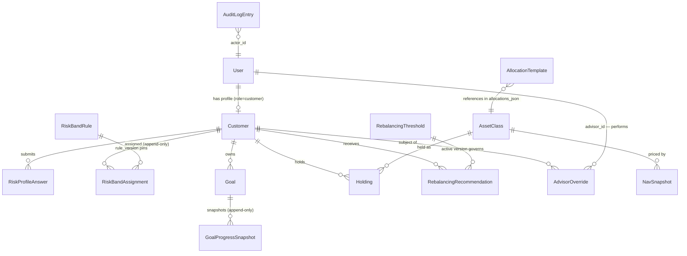

# Data Models — WealthWise

Persistence design for all 14 entities named in BRD section 9, plus the `RebalancingThreshold` table introduced by `system-design.md` section 6.1.

Database: **SQLite**, single file `backend/wealthwise.db`. Schema managed by **Alembic**, migrations directory append-only (NFR-05). ORM: SQLAlchemy 2.x declarative models in `backend/src/db/models.py`; Pydantic mirrors in `backend/src/types/`; TypeScript mirrors in `frontend/src/types/entities.ts`.

---

## 1. Conventions

| Convention | Rule |
|---|---|
| Field names | **Exactly** as written in BRD section 9. No renaming, no pluralisation changes, no camelCase on the backend. The frontend TypeScript mirrors use the identical snake_case names so JSON needs no key mapping. |
| Primary keys | `id INTEGER PRIMARY KEY AUTOINCREMENT` on every table. |
| Foreign keys | `<entity>_id INTEGER NOT NULL REFERENCES <table>(id)`. `PRAGMA foreign_keys = ON` is set on every connection. |
| Timestamps | Stored as ISO-8601 UTC strings with `Z` suffix (`TEXT`), e.g. `"2026-09-03T10:15:00Z"`. SQLite has no native timestamp type; TEXT ISO-8601 sorts correctly lexicographically. |
| Dates | Stored as `TEXT` in `YYYY-MM-DD` (`price_date`, `target_date`, `as_of_date`). |
| Booleans | Stored as `INTEGER` 0/1 (`kyc_verified`, `is_active`); exposed as JSON `true`/`false`. |
| JSON columns | Stored as `TEXT` containing a JSON document; validated by a Pydantic model on read and write. Never queried by SQL path expressions. |
| Enums | Stored as `TEXT` with a `CHECK` constraint listing the exact literal values. |
| Nullability | Every column is `NOT NULL` unless explicitly marked nullable in the tables below. |

### 1.1 Additive fields beyond BRD section 9

The BRD's data-model table lists key fields, not complete DDL. The following columns exist in addition; each is listed here so the delta is explicit and reviewable. **No BRD field is renamed or omitted.**

| Table | Added column | Why |
|---|---|---|
| `User` | `created_at` | Standard row provenance; used to order seeded accounts deterministically. |
| `Customer` | `created_at` | Same. |
| `Goal` | `updated_at` | E7-S2 AC4 requires editing a goal "without altering `created_at`" — that is only observable if a separate mutation timestamp exists. |
| `GoalProgressSnapshot` | `price_date` | E7-S3 AC4 requires progress recompute to be idempotent *for a given `price_date`*; the uniqueness constraint needs the column. |
| `RebalancingRecommendation` | — | `recommendation_id` is a BRD field; its semantics are fixed here (public UUID, see §2.12). |
| *(new table)* | `RebalancingThreshold` | `system-design.md` §6.1 — resolves BRD §13's deferred threshold-storage question. |

Deliberately **not** added: a `full_name` / display-name column on `Customer`. The advisor customer list identifies customers by `User.email` and `Customer.id`. Introducing a name field would add PII with no acceptance criterion requiring it (NFR-03).

---

## 2. Fixed-Point Convention (NFR-01) — normative

Floating-point types are prohibited for money, percentages and drift at **every** layer: SQLite column, Python domain object, JSON payload, and TypeScript value.

| Quantity class | SQLite column type | Meaning of the stored integer | Python type | JSON transport | TypeScript type |
|---|---|---|---|---|---|
| **Money** — `target_amount`, `current_value`, `nav_value`, action `amount` | `INTEGER` | **minor units**, scale 2 (cents). `2500000` = 25 000.00 | `decimal.Decimal` quantized to `Decimal("0.01")` | **string**, exactly 2 decimals: `"25000.00"` | `string` |
| **Percentage / drift** — `percent_complete`, `current_percent`, `target_percent`, `drift_percent`, allocation `percent` | `INTEGER` | **basis points**, 1 bp = 0.01%. `6000` = 60.00%, `10000` = 100.00% | `decimal.Decimal` quantized to `Decimal("0.01")` | **string**, exactly 2 decimals: `"60.00"`, `"-7.25"` | `string` |
| **Threshold** — `threshold_bps` | `INTEGER` | basis points | `int` | **integer** `threshold_bps` (canonical) plus `threshold_percent` string for display | `number` + `string` |
| **Units / quantities** — `units` inside `proposed_actions_json` | JSON string | decimal string, scale 4 | `Decimal` quantized to `Decimal("0.0001")` | **string**, 4 decimals: `"12.3456"` | `string` |

Rules:

1. Money and percentages are **never** JSON numbers. A JSON number becomes an IEEE-754 double in JavaScript; string transport is what makes NFR-01 hold across the wire.
2. `float` is banned in `backend/src/domain/**` and `backend/src/db/**` — asserted by `tests/architecture/test_no_float_in_domain.py`.
3. Rounding is `ROUND_HALF_UP`, applied once at persistence or serialisation, never mid-calculation.
4. Sum-to-100 is `sum(percent_bps) == 10000`, exact, no tolerance (AC-02, NFR-08).
5. Percent columns storing a signed value (`drift_percent`) may be negative; all other integer money/percent columns carry a `CHECK (col >= 0)`.

**Naming note.** Columns store basis points but keep the BRD's field name (`percent_complete`, not `percent_complete_bps`) so the BRD, the API and the mockups all use one vocabulary. The single exception is `threshold_bps`, whose name carries the unit because its API representation is also an integer. The API layer converts bp integers to 2-dp strings on the way out and parses them back on the way in; that conversion lives in `backend/src/types/fixedpoint.py` and nowhere else.

---

## 3. Entity Relationship Overview



Relationship cardinalities in words:

- `User` 1 — 0..1 `Customer`. Only `role = "customer"` users have a `Customer` row; advisor/admin/compliance users do not.
- `Customer` 1 — 0..* of `RiskProfileAnswer`, `RiskBandAssignment`, `Goal`, `Holding`, `RebalancingRecommendation`, `AdvisorOverride`.
- `Goal` 1 — 0..* `GoalProgressSnapshot`.
- `AssetClass` 1 — 0..* `NavSnapshot`, 1 — 0..* `Holding`.
- `AllocationTemplate` references `AssetClass` **by id inside `allocations_json`**, not via a foreign key. This is deliberate (E10-S1 AC4): renaming an asset class must not alter historical published templates, and a published template's JSON is immutable.
- `AuditLogEntry.entity_id` is a **soft reference** — it points at whatever `entity_type` names, with no FK, because it spans nine different tables.

---

## 4. Entity Specifications

Each entity below gives: columns, constraints, indexes, relationships, and one example JSON record **as the API returns it** (i.e. after bp→string conversion).

### 4.1 User

| Column | Type | Constraints | Notes |
|---|---|---|---|
| `id` | INTEGER | PK, autoincrement | |
| `email` | TEXT | NOT NULL, **UNIQUE**, lowercased on write | Login identifier |
| `password_hash` | TEXT | NOT NULL | bcrypt hash, cost factor 12. **Never** serialised in any API response |
| `role` | TEXT | NOT NULL, `CHECK (role IN ('customer','advisor','admin','compliance'))` | Flat field — no separate Advisor/Admin profile tables (BRD §9) |
| `created_at` | TEXT | NOT NULL, ISO-8601 UTC | additive |

**Indexes:** `UNIQUE ix_user_email (email)`; `ix_user_role (role)`.
**Relationships:** 1 — 0..1 `Customer`; referenced by `AdvisorOverride.advisor_id` and `AuditLogEntry.actor_id`.
**Seed volume:** 8–10 customer users, 2 advisors, 1 admin, 1 compliance (BRD §9). No self-registration path exists (E2-S1 AC5).

```json
{
  "id": 3,
  "email": "customer03@wealthwise.test",
  "role": "customer",
  "created_at": "2026-09-01T09:00:00Z"
}
```
> `password_hash` is present in the table and absent from every response shape (E2-S2 AC4).

---

### 4.2 Customer

| Column | Type | Constraints | Notes |
|---|---|---|---|
| `id` | INTEGER | PK, autoincrement | |
| `user_id` | INTEGER | NOT NULL, **UNIQUE**, FK → `User(id)` | One customer profile per user |
| `kyc_verified` | INTEGER (bool) | NOT NULL, DEFAULT 1 | Stub flag. Its one real gating branch: `false` blocks rebalancing recommendation generation (BRD §5.1, E8-S2 AC4). No verification flow, no UI |
| `created_at` | TEXT | NOT NULL | additive |

**Indexes:** `UNIQUE ix_customer_user_id (user_id)`.
**Relationships:** parent of answers, assignments, goals, holdings, recommendations, overrides.
**Seed rule:** all seeded customers have `kyc_verified = true` except at least one set to `false`, to support the AC-06 gating test (E1-S3 AC3).

```json
{
  "id": 3,
  "user_id": 3,
  "kyc_verified": true,
  "created_at": "2026-09-01T09:00:00Z"
}
```

---

### 4.3 RiskProfileAnswer — append-only (NFR-02)

| Column | Type | Constraints | Notes |
|---|---|---|---|
| `id` | INTEGER | PK | |
| `customer_id` | INTEGER | NOT NULL, FK → `Customer(id)` | |
| `question_id` | TEXT | NOT NULL | Matches a `question_id` in the active `RiskBandRule.questionnaire_json` |
| `answer_value` | TEXT | NOT NULL | The selected option's `value`, not its display label |
| `submitted_at` | TEXT | NOT NULL, ISO-8601 UTC | All answers of one submission share the same timestamp |

**Indexes:** `ix_rpa_customer_submitted (customer_id, submitted_at)`.
**Constraints:** insert-only. The repository exposes no `update_*` / `delete_*` (E4-S1 AC3). A resubmission writes a whole new set of rows; prior answers remain queryable.
**Relationships:** many → 1 `Customer`.

```json
{
  "id": 41,
  "customer_id": 3,
  "question_id": "Q4",
  "answer_value": "hold_and_wait",
  "submitted_at": "2026-09-03T10:15:00Z"
}
```

---

### 4.4 RiskBandAssignment — append-only (NFR-02)

| Column | Type | Constraints | Notes |
|---|---|---|---|
| `id` | INTEGER | PK | |
| `customer_id` | INTEGER | NOT NULL, FK → `Customer(id)` | |
| `risk_band` | TEXT | NOT NULL, `CHECK (risk_band IN ('CONSERVATIVE','MODERATE','AGGRESSIVE'))` | |
| `rule_version` | INTEGER | NOT NULL | The `RiskBandRule.version` used — pins the customer to an immutable rule (AC-10) |
| `assigned_at` | TEXT | NOT NULL, ISO-8601 UTC | |

**Indexes:** `ix_rba_customer_assigned (customer_id, assigned_at DESC)`.
**Constraints:** never updated in place. Both a questionnaire submission (E4-S2) and an advisor override (E9-S2 AC1) insert a **new** row; "current band" is always `ORDER BY assigned_at DESC, id DESC LIMIT 1`.
**Relationships:** many → 1 `Customer`; `rule_version` soft-references `RiskBandRule.version`.

```json
{
  "id": 12,
  "customer_id": 3,
  "risk_band": "MODERATE",
  "rule_version": 1,
  "assigned_at": "2026-09-03T10:15:00Z"
}
```

---

### 4.5 RiskBandRule — insert-only, immutable once published (AC-10)

| Column | Type | Constraints | Notes |
|---|---|---|---|
| `id` | INTEGER | PK | |
| `version` | INTEGER | NOT NULL, **UNIQUE**, monotonic | `max(version) + 1` on publish. Uniqueness turns a concurrent publish race into a 409 (BRD §11) |
| `questionnaire_json` | TEXT (JSON) | NOT NULL, ≥6 questions | See shape below |
| `scoring_rules_json` | TEXT (JSON) | NOT NULL | Integer band ranges |
| `published_at` | TEXT | NOT NULL | |
| `is_active` | INTEGER (bool) | NOT NULL | Exactly one row has `is_active = 1` at any time (E4-S1 AC2) |

**Indexes:** `UNIQUE ix_rbr_version (version)`; partial `ix_rbr_active (is_active) WHERE is_active = 1`.
**Immutability:** `questionnaire_json` and `scoring_rules_json` are never updated. Only `is_active` flips `1 → 0` when superseded (`system-design.md` §8, exception 1).

`questionnaire_json` shape:
```json
{
  "questions": [
    {
      "question_id": "Q1",
      "text": "What is your investment time horizon?",
      "options": [
        { "value": "lt_3y",  "label": "Less than 3 years", "points": 1 },
        { "value": "3_7y",   "label": "3 to 7 years",      "points": 3 },
        { "value": "gt_7y",  "label": "More than 7 years", "points": 5 }
      ]
    }
  ]
}
```
`scoring_rules_json` shape — integer, closed, non-overlapping, contiguous ranges (NFR-01):
```json
{
  "bands": [
    { "risk_band": "CONSERVATIVE", "min_points": 6,  "max_points": 13 },
    { "risk_band": "MODERATE",     "min_points": 14, "max_points": 22 },
    { "risk_band": "AGGRESSIVE",   "min_points": 23, "max_points": 30 }
  ]
}
```

Example record (truncated `questionnaire_json` for readability):
```json
{
  "id": 1,
  "version": 1,
  "questionnaire_json": { "questions": [ { "question_id": "Q1", "text": "What is your investment time horizon?", "options": [ { "value": "lt_3y", "label": "Less than 3 years", "points": 1 } ] } ] },
  "scoring_rules_json": { "bands": [ { "risk_band": "CONSERVATIVE", "min_points": 6, "max_points": 13 }, { "risk_band": "MODERATE", "min_points": 14, "max_points": 22 }, { "risk_band": "AGGRESSIVE", "min_points": 23, "max_points": 30 } ] },
  "published_at": "2026-09-01T09:00:00Z",
  "is_active": true
}
```

---

### 4.6 AllocationTemplate — insert-only, immutable once published (AC-02, AC-10)

| Column | Type | Constraints | Notes |
|---|---|---|---|
| `id` | INTEGER | PK | |
| `version` | INTEGER | NOT NULL, monotonic per risk band | |
| `risk_band` | TEXT | NOT NULL, `CHECK (risk_band IN ('CONSERVATIVE','MODERATE','AGGRESSIVE'))` | |
| `allocations_json` | TEXT (JSON) | NOT NULL, `sum(percent_bps) == 10000` | Enforced at the repository boundary (E5-S1 AC1) *and* as an architecture test (NFR-08) |
| `published_at` | TEXT | NOT NULL | |
| `is_active` | INTEGER (bool) | NOT NULL | Exactly one active row **per risk band** (E5-S1 AC3) |

**Indexes:** `UNIQUE ix_at_band_version (risk_band, version)` — this composite uniqueness is what rejects a concurrent second publish for the same band with 409 (BRD §11, E10-S1 AC2); `ix_at_band_active (risk_band, is_active)`.
**Immutability:** `allocations_json` is never updated; a correction is a new version. Superseded versions stay individually queryable by `version` so in-flight customers remain pinned (E5-S1 AC4).
**Seed volume:** 2 versions per band, 6 rows total (E5-S1 AC5).

`allocations_json` — **stored** form (basis points):
```json
{ "allocations": [ { "asset_class_id": 1, "percent_bps": 4000 }, { "asset_class_id": 2, "percent_bps": 3500 }, { "asset_class_id": 3, "percent_bps": 2500 } ] }
```

Example record — **API** form (bp converted to 2-dp strings, `asset_class_code` joined in for display):
```json
{
  "id": 4,
  "version": 2,
  "risk_band": "MODERATE",
  "allocations": [
    { "asset_class_id": 1, "asset_class_code": "EQ_DM", "percent": "40.00" },
    { "asset_class_id": 2, "asset_class_code": "FI_GOV", "percent": "35.00" },
    { "asset_class_id": 3, "asset_class_code": "CASH", "percent": "25.00" }
  ],
  "published_at": "2026-09-02T11:00:00Z",
  "is_active": true
}
```

---

### 4.7 Goal — mutable (AC-03)

| Column | Type | Constraints | Notes |
|---|---|---|---|
| `id` | INTEGER | PK | |
| `customer_id` | INTEGER | NOT NULL, FK → `Customer(id)` | Ownership enforced in the service (E7-S2 AC5) |
| `target_amount` | INTEGER | NOT NULL, `CHECK (target_amount > 0)` | **Money — minor units.** `> 0` implements E7-S2 AC1 at the DB level too |
| `target_date` | TEXT | NOT NULL, `YYYY-MM-DD` | Must be in the future at creation time (E7-S2 AC2, service-enforced) |
| `priority` | INTEGER | NOT NULL, `CHECK (priority BETWEEN 1 AND 5)` | 1 = highest |
| `created_at` | TEXT | NOT NULL | Never altered by an edit (E7-S2 AC4) |
| `updated_at` | TEXT | NOT NULL | additive; moves on every edit |

**Indexes:** `ix_goal_customer (customer_id)`.
**Mutability:** `target_amount`, `target_date` and `priority` are editable via `PATCH`. This is one of only two genuinely mutable domain tables; its change history is carried by `AuditLogEntry`, and its value history by the append-only `GoalProgressSnapshot` series (E7-S1 AC5).
**Relationships:** many → 1 `Customer`; 1 → 0..* `GoalProgressSnapshot`.

```json
{
  "id": 7,
  "customer_id": 3,
  "target_amount": "250000.00",
  "target_date": "2032-06-30",
  "priority": 1,
  "created_at": "2026-09-01T09:30:00Z",
  "updated_at": "2026-09-03T10:20:00Z"
}
```

---

### 4.8 GoalProgressSnapshot — append-only (AC-08, NFR-02)

| Column | Type | Constraints | Notes |
|---|---|---|---|
| `id` | INTEGER | PK | |
| `goal_id` | INTEGER | NOT NULL, FK → `Goal(id)` | |
| `current_value` | INTEGER | NOT NULL, `CHECK (current_value >= 0)` | **Money — minor units.** Customer's total holdings value attributed to this goal |
| `percent_complete` | INTEGER | NOT NULL, `CHECK (percent_complete BETWEEN 0 AND 20000)` | **Basis points.** `current_value * 10000 / target_amount`, integer division with `ROUND_HALF_UP`, **capped at 20000 (= 200.00%)** — the documented maximum required by E7-S3 AC2 |
| `snapshot_at` | TEXT | NOT NULL, ISO-8601 UTC | |
| `price_date` | TEXT | NOT NULL, `YYYY-MM-DD` | additive — the simulated NAV date this snapshot was computed from |

**Indexes:** `UNIQUE ix_gps_goal_pricedate (goal_id, price_date)` — makes recompute idempotent per simulated day (E7-S3 AC4) at the DB level rather than by a check-then-act read; `ix_gps_goal_snapshot (goal_id, snapshot_at DESC)` for `get_latest_progress`.
**Edge case:** `current_value = 0` yields `percent_complete = 0`, never a division error (E7-S3 AC3). `target_amount > 0` is guaranteed by the `Goal` CHECK, so the divisor is never zero.
**Relationships:** many → 1 `Goal`.

```json
{
  "id": 88,
  "goal_id": 7,
  "current_value": "62500.00",
  "percent_complete": "25.00",
  "snapshot_at": "2026-09-03T10:30:00Z",
  "price_date": "2026-09-04"
}
```

---

### 4.9 AssetClass — master data, mutable (E10-S1 AC4)

| Column | Type | Constraints | Notes |
|---|---|---|---|
| `id` | INTEGER | PK | Stable — referenced by `allocations_json`, `NavSnapshot`, `Holding` |
| `code` | TEXT | NOT NULL, **UNIQUE** | e.g. `EQ_DM`. Duplicate insert → 409 (E10-S3 AC3) |
| `name` | TEXT | NOT NULL | e.g. `Developed-Market Equity` |

**Indexes:** `UNIQUE ix_ac_code (code)`.
**Mutability:** `code` and `name` are editable. Because templates reference `asset_class_id`, editing a code never rewrites a published template (E10-S1 AC4). Deletion is not supported — an asset class referenced by history cannot be removed.
**Seed volume:** 5–6 rows (BRD §9).

```json
{ "id": 1, "code": "EQ_DM", "name": "Developed-Market Equity" }
```

---

### 4.10 NavSnapshot — append-only

| Column | Type | Constraints | Notes |
|---|---|---|---|
| `id` | INTEGER | PK | |
| `asset_class_id` | INTEGER | NOT NULL, FK → `AssetClass(id)` | |
| `price_date` | TEXT | NOT NULL, `YYYY-MM-DD` | Simulated date, advanced only by the manual trigger |
| `nav_value` | INTEGER | NOT NULL, `CHECK (nav_value > 0)` | **Money — minor units** (E6-S1 AC5) |

**Indexes:** `UNIQUE ix_nav_ac_date (asset_class_id, price_date)` — the DB-level guarantee behind the double-advance edge case (BRD §11, E6-S2 AC2); `ix_nav_ac_date_desc (asset_class_id, price_date DESC)` for `get_latest_nav`.
**Constraints:** no update method exists (E6-S1 AC3). Loaded initially from the seed CSV at `seed_csv_path`; subsequent rows created only by advance-a-day.
**Relationships:** many → 1 `AssetClass`.

```json
{ "id": 25, "asset_class_id": 1, "price_date": "2026-09-04", "nav_value": "132.45" }
```

---

### 4.11 Holding — mutable (revalued each advance-a-day)

| Column | Type | Constraints | Notes |
|---|---|---|---|
| `id` | INTEGER | PK | |
| `customer_id` | INTEGER | NOT NULL, FK → `Customer(id)` | |
| `asset_class_id` | INTEGER | NOT NULL, FK → `AssetClass(id)` | |
| `current_value` | INTEGER | NOT NULL, `CHECK (current_value >= 0)` | **Money — minor units** |
| `as_of_date` | TEXT | NOT NULL, `YYYY-MM-DD` | The `price_date` this value reflects |

**Indexes:** `UNIQUE ix_holding_customer_ac (customer_id, asset_class_id)` — one holding row per customer per asset class; `ix_holding_customer (customer_id)`.
**Mutability:** `current_value` and `as_of_date` are rewritten by the advance-a-day revaluation. `Holding` is a *current-position* table, not a history table — history lives in `NavSnapshot` and `GoalProgressSnapshot`. It is therefore **not** subject to NFR-02.
**Derived values (never stored):** `current_percent`, `target_percent`, `drift_percent` are computed on read by `holdings/service.py` (see §5).

```json
{ "id": 15, "customer_id": 3, "asset_class_id": 1, "current_value": "48200.00", "as_of_date": "2026-09-04" }
```

---

### 4.12 RebalancingRecommendation — append-only with one-shot status transition (AC-06, AC-07)

| Column | Type | Constraints | Notes |
|---|---|---|---|
| `id` | INTEGER | PK | Internal surrogate key |
| `customer_id` | INTEGER | NOT NULL, FK → `Customer(id)` | |
| `recommendation_id` | TEXT | NOT NULL, **UNIQUE** | **Public identifier — a UUID4 string.** This is the id used in API paths (`/api/rebalancing/{recommendation_id}/accept`) so internal row ids are never exposed and are not guessable across customers |
| `proposed_actions_json` | TEXT (JSON) | NOT NULL, non-empty array | See shape below. Never rewritten |
| `status` | TEXT | NOT NULL, `CHECK (status IN ('pending','accepted','dismissed'))`, DEFAULT `'pending'` | |
| `generated_at` | TEXT | NOT NULL | Never rewritten |
| `resolved_at` | TEXT | **NULLABLE** | Set exactly once, when `status` leaves `pending` |

**Indexes:** `UNIQUE ix_rr_recommendation_id (recommendation_id)`; `ix_rr_customer_status (customer_id, status)` for `get_pending`.
**Lifecycle:** `pending → accepted` or `pending → dismissed`, once. A second transition attempt is rejected with 409 and leaves `resolved_at` unchanged (E8-S1 AC4, E8-S3 AC4). No hard-delete method exists (E8-S1 AC3).
**Generation gates:** no row is created when the customer has zero holdings, when no asset class exceeds the active threshold, or when `Customer.kyc_verified = false` (E8-S2 AC2–AC4).

`proposed_actions_json` shape — amounts and units are decimal **strings** (NFR-01):
```json
{
  "actions": [
    { "asset_class_id": 1, "asset_class_code": "EQ_DM",  "action": "SELL", "amount": "3200.00", "units": "24.1600", "drift_percent": "6.40" },
    { "asset_class_id": 3, "asset_class_code": "CASH",   "action": "BUY",  "amount": "3200.00", "units": "32.0000", "drift_percent": "-6.40" }
  ],
  "threshold_bps": 500,
  "threshold_version": 1
}
```
> `threshold_bps`/`threshold_version` are embedded so a recommendation remains explainable after Admin publishes a new threshold version.

Example record:
```json
{
  "id": 9,
  "customer_id": 3,
  "recommendation_id": "b6f0c2a4-1d3e-4f58-9a71-0c2e5d8b7a10",
  "proposed_actions": [
    { "asset_class_id": 1, "asset_class_code": "EQ_DM", "action": "SELL", "amount": "3200.00", "units": "24.1600", "drift_percent": "6.40" },
    { "asset_class_id": 3, "asset_class_code": "CASH", "action": "BUY", "amount": "3200.00", "units": "32.0000", "drift_percent": "-6.40" }
  ],
  "status": "pending",
  "generated_at": "2026-09-04T08:00:00Z",
  "resolved_at": null
}
```

---

### 4.13 AdvisorOverride — append-only, audited (AC-09, NFR-02)

| Column | Type | Constraints | Notes |
|---|---|---|---|
| `id` | INTEGER | PK | |
| `customer_id` | INTEGER | NOT NULL, FK → `Customer(id)` | |
| `advisor_id` | INTEGER | NOT NULL, FK → `User(id)` | The advisor's **user** id, taken from the JWT `sub` — never from the request body |
| `previous_band` | TEXT | NOT NULL, `CHECK (... IN ('CONSERVATIVE','MODERATE','AGGRESSIVE'))` | Must equal the customer's latest `RiskBandAssignment.risk_band` at override time (E9-S1 AC5) |
| `new_band` | TEXT | NOT NULL, same CHECK | |
| `reason` | TEXT | NOT NULL, length ≥ 1 after trimming | Mandatory (BRD §5.1, E9-S1 AC4); empty → 422 |
| `note` | TEXT | **NULLABLE** | Optional supporting detail |
| `created_at` | TEXT | NOT NULL | |

**Indexes:** `ix_ao_customer_created (customer_id, created_at DESC)` for `get_overrides` ordering (E9-S1 AC3).
**Constraints:** no update or delete method (E9-S1 AC2). Each override also inserts a new `RiskBandAssignment` in the same transaction (E9-S2 AC1).

```json
{
  "id": 4,
  "customer_id": 3,
  "advisor_id": 11,
  "previous_band": "MODERATE",
  "new_band": "CONSERVATIVE",
  "reason": "Client reported imminent liquidity need",
  "note": "Discussed on call 2026-09-03; revisit after property sale completes.",
  "created_at": "2026-09-03T14:05:00Z"
}
```

---

### 4.14 AuditLogEntry — append-only, insert-only (NFR-02)

| Column | Type | Constraints | Notes |
|---|---|---|---|
| `id` | INTEGER | PK | |
| `entity_type` | TEXT | NOT NULL, CHECK over the closed set below | |
| `entity_id` | TEXT | NOT NULL | Soft reference — string, because it may be an integer id or a `recommendation_id` UUID |
| `actor_id` | INTEGER | NOT NULL, FK → `User(id)` | |
| `actor_role` | TEXT | NOT NULL, `CHECK (actor_role IN ('customer','advisor','admin','compliance'))` | Rejected outside this set (E3-S2 AC2) |
| `action` | TEXT | NOT NULL | Upper-snake verb, e.g. `ASSIGN_RISK_BAND` |
| `timestamp` | TEXT | NOT NULL, ISO-8601 UTC | |
| `details_json` | TEXT (JSON) | NOT NULL | Ids, enums, version numbers only — **no raw PII, no position values** (NFR-03, E3-S1 AC5) |

**`entity_type` closed set:** `RiskBandAssignment`, `AllocationRecommendation`, `RebalancingRecommendation`, `AdvisorOverride`, `ManualRecommendation`, `RiskBandRule`, `AllocationTemplate`, `AssetClass`, `RebalancingThreshold`.

**`action` vocabulary:** `ASSIGN_RISK_BAND`, `GENERATE_ALLOCATION_RECOMMENDATION`, `GENERATE_REBALANCING_RECOMMENDATION`, `ACCEPT_REBALANCING_RECOMMENDATION`, `DISMISS_REBALANCING_RECOMMENDATION`, `OVERRIDE_RISK_BAND`, `LOG_MANUAL_RECOMMENDATION`, `PUBLISH_RISK_BAND_RULE`, `PUBLISH_ALLOCATION_TEMPLATE`, `PUBLISH_REBALANCING_THRESHOLD`, `CREATE_ASSET_CLASS`, `UPDATE_ASSET_CLASS`.

**Indexes:** `ix_ale_timestamp (timestamp)`; `ix_ale_entity_type_ts (entity_type, timestamp)` for the compliance filter (E3-S3 AC4); `ix_ale_actor_ts (actor_id, timestamp)`.
**Constraints:** the repository exposes only `insert_audit_entry` — no update, no delete, anywhere in the module (E3-S1 AC1/AC3). Queries by `entity_type` + date range return `ORDER BY timestamp ASC` (E3-S1 AC4).

**PII exception, stated:** the manual-recommendation note is stored in `details_json` (`system-design.md` §6.4) because the note *is* the record. It is never written to application logs.

```json
{
  "id": 501,
  "entity_type": "RiskBandAssignment",
  "entity_id": "12",
  "actor_id": 3,
  "actor_role": "customer",
  "action": "ASSIGN_RISK_BAND",
  "timestamp": "2026-09-03T10:15:00Z",
  "details_json": { "customer_id": 3, "risk_band": "MODERATE", "rule_version": 1 }
}
```

---

### 4.15 RebalancingThreshold — insert-only, versioned (new; `system-design.md` §6.1)

| Column | Type | Constraints | Notes |
|---|---|---|---|
| `id` | INTEGER | PK | |
| `version` | INTEGER | NOT NULL, **UNIQUE**, monotonic | `max(version) + 1` on publish; uniqueness → 409 on a concurrent publish |
| `threshold_bps` | INTEGER | NOT NULL, `CHECK (threshold_bps BETWEEN 1 AND 10000)` | **Basis points.** Seeded at `500` = 5.00% (BRD §5.1 default) |
| `published_at` | TEXT | NOT NULL | |
| `is_active` | INTEGER (bool) | NOT NULL | Exactly one active row at any time |

**Indexes:** `UNIQUE ix_rt_version (version)`; partial `ix_rt_active (is_active) WHERE is_active = 1`.
**Immutability:** `threshold_bps` is never updated; only `is_active` flips when superseded — the same pattern as `RiskBandRule` and `AllocationTemplate`.
**Runtime use:** `rebalancing/service.py` reads the active row on every evaluation. `core/config.py`'s `default_drift_threshold_percent` seeds `version = 1` only and is not read at runtime (`system-design.md` §6.1).
**Comparison semantics:** exclusive — a recommendation is generated only when `abs(drift_bps) > threshold_bps` (E6-S3 AC4).

```json
{ "id": 1, "version": 1, "threshold_bps": 500, "threshold_percent": "5.00", "published_at": "2026-09-01T09:00:00Z", "is_active": true }
```

---

## 5. Derived (Non-Persisted) Values

These appear in API responses but have no column. They are recomputed on read so they can never go stale relative to `NavSnapshot`.

| Value | Formula (integer arithmetic) | Where computed |
|---|---|---|
| `total_value` | `sum(Holding.current_value)` for the customer, minor units | `holdings/service.py` |
| `current_percent` | `round_half_up(holding.current_value * 10000 / total_value)` bps; the largest holding absorbs the ±1 bp residual so the set sums to exactly `10000` | `holdings/service.py` |
| `target_percent` | `percent_bps` for that asset class in the customer's active `AllocationTemplate`; `0` if the template omits the asset class | `holdings/service.py` |
| `drift_percent` | `current_percent_bps - target_percent_bps` (signed, may be negative) | `holdings/service.py` |
| `exceeds_threshold` | `abs(drift_percent_bps) > active threshold_bps` (**strictly greater**) | `holdings/service.py` |
| `units` (in a proposed action) | `amount_minor * 10000 / nav_value_minor`, quantized to 4 dp | `rebalancing/service.py` |
| current `risk_band` | latest `RiskBandAssignment` by `assigned_at DESC, id DESC` | `risk_profile/service.py` |

Zero-holdings case: `total_value = 0` → the drift result is an **empty list**, not an error and not a divide-by-zero (E6-S3 AC3, E6-S4 AC5).

---

## 6. Migration Plan (Alembic, append-only — NFR-05)

Revisions are linear and named for the story that introduces them. A committed revision is never edited; corrections are new revisions.

| Revision | Creates | Story |
|---|---|---|
| `0001_initial_users_customers` | `User`, `Customer` | E1-S3 |
| `0002_audit_log` | `AuditLogEntry` | E3-S1 |
| `0003_risk_profile` | `RiskBandRule`, `RiskProfileAnswer`, `RiskBandAssignment` | E4-S1 |
| `0004_allocation_template` | `AllocationTemplate` | E5-S1 |
| `0005_asset_class_nav_holding` | `AssetClass`, `NavSnapshot`, `Holding` | E6-S1 |
| `0006_goals` | `Goal`, `GoalProgressSnapshot` | E7-S1 |
| `0007_rebalancing` | `RebalancingRecommendation`, `RebalancingThreshold` | E8-S1 |
| `0008_advisor_override` | `AdvisorOverride` | E9-S1 |

`alembic upgrade head` is idempotent against an already-migrated database (E1-S3 AC5). Any future change to an existing table must use `op.batch_alter_table` because SQLite cannot drop or retype a column in place.

---

## 7. Seed Data Summary (BRD §9 volumes)

| Entity | Volume | Notes |
|---|---|---|
| `User` | 8–10 customer + 2 advisor + 1 admin + 1 compliance | bcrypt hashes, no self-registration |
| `Customer` | 8–10 | Spanning all three risk bands; **at least one with `kyc_verified = false`** (E1-S3 AC3) |
| `RiskBandRule` | 1 | `version = 1`, ≥6 questions, `is_active = true` |
| `AllocationTemplate` | 6 | 2 versions × 3 risk bands; the later version active per band |
| `AssetClass` | 5–6 | From the seed CSV, unique `code` |
| `NavSnapshot` | 1 per asset class | Initial `price_date` from the seed CSV |
| `Holding` | Several per customer | Deliberately includes at least one customer whose drift exceeds 5.00% and one whose drift is within tolerance, so both E8-S2 branches are demonstrable |
| `RebalancingThreshold` | 1 | `version = 1`, `threshold_bps = 500` |
| `Goal` | 1–3 per customer | Future `target_date`, positive `target_amount` |
| `RiskBandAssignment` | 1 per customer | `rule_version = 1` |

The seed loader is idempotent: re-running against a seeded database creates no duplicate `AssetClass` rows (E6-S1 AC2) and no duplicate users.
