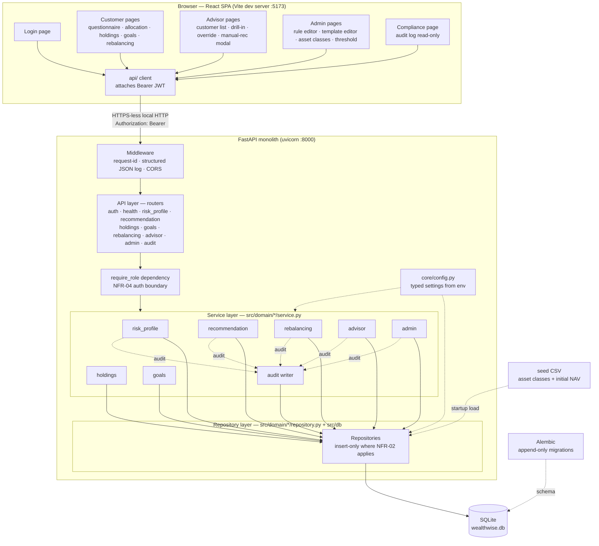
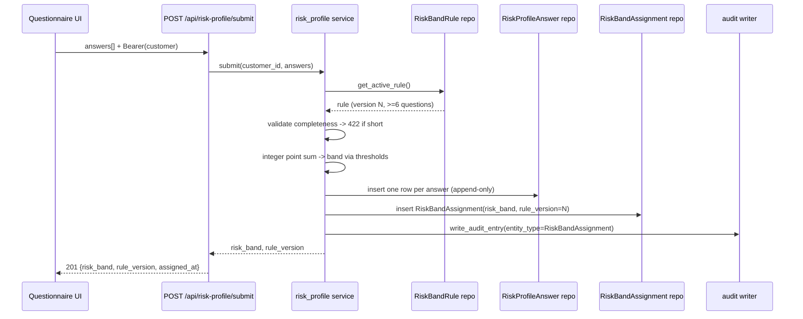
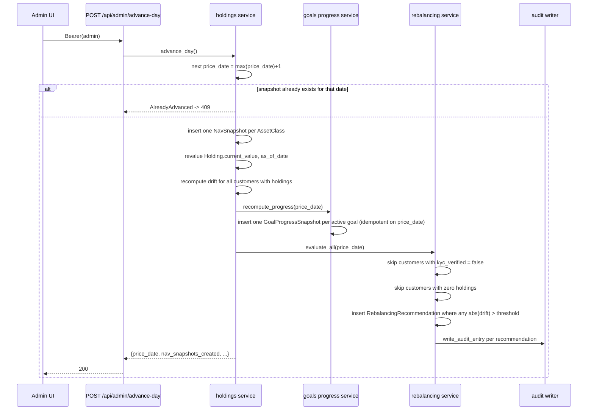

# System Design — WealthWise

**Robo-Advisory & Portfolio Recommendation Platform** | Business Case BC-AINE-008
Derived from: `specs/brd/brd.md` (approved), `project-manifest.json` (fixed stack), `design.md` (harness reference), `specs/stories/` (41 stories + dependency graph).
Date: 2026-09-03

---

## 1. Purpose and Scope of This Document

This document fixes the technical shape of WealthWise so that the generator, test-engineer, and evaluator agents can build without further architectural decisions. The stack and architecture pattern are **already decided** by the BRD (section 8) and `project-manifest.json` and are not re-litigated here. What this document adds is:

- Component decomposition and the exact layering contract (section 3)
- Runtime data flows for the five non-trivial domain flows (section 5)
- **Concrete resolutions for the four items BRD section 13 deferred to `/design`** (section 6)
- The fixed-point arithmetic convention that satisfies NFR-01 end to end (section 7)
- The append-only / immutability enforcement strategy for NFR-02, NFR-05 and AC-10 (section 8)

Companion documents: `api-contracts.md` + `api-contracts.schema.json` (endpoint surface), `data-models.md` + `data-models.schema.json` (persistence), `folder-structure.md` (file layout), `component-map.md` (story → file routing), `deployment.md` (dev environment and CI).

---

## 2. Architecture Overview

WealthWise is a **single modular monolith**: one FastAPI backend process, one React SPA, one SQLite file. No service mesh, no message broker, no cache, no external integrations. This follows BRD section 7 Option A, chosen over a two-service split (Option B) and a file-based policy engine (Option C).

| Concern | Decision |
|---|---|
| Backend | Python 3.12, FastAPI, `uv`, `ruff`, `mypy`, `pytest` |
| Frontend | TypeScript, React, Vite, `npm`, `eslint`, `tsc`, `vitest` |
| Database | SQLite, single file, accessed through SQLAlchemy Core/ORM |
| Migrations | Alembic, append-only migration directory (section 6.3) |
| Auth | JWT access token only, bcrypt password hashes, seeded accounts, no self-registration (section 6.2) |
| Deployment | Local dev servers only — backend `:8000`, frontend `:5173`. No Docker, no staging, no production |
| CI | GitLab CI (`.gitlab-ci.yml`) with Claude Code Action review stage |

### 2.1 Layering Contract

Dependencies flow **one way only**. The `check-architecture` hook enforces this on every file save; a violation fails the build.

```
Types  →  Config  →  Repository  →  Service  →  API  →  UI
```

| Layer | Backend location | May import from | May NOT import from |
|---|---|---|---|
| Types | `backend/src/types/` | stdlib, pydantic | anything project-local except other `types` modules |
| Config | `backend/src/core/` | `types` | `db`, `domain`, `app` |
| Repository | `backend/src/db/`, `backend/src/domain/*/repository.py` | `types`, `core`, `db` | `domain/*/service.py`, `app` |
| Service | `backend/src/domain/*/service.py` | `types`, `core`, any `domain/*/repository.py`, other services | `app` (never imports routers, never touches `Request`/`Response`) |
| API | `backend/src/app/` | `types`, `core`, `domain/*/service.py` | `domain/*/repository.py` (routers never reach past the service layer) |
| UI | `frontend/src/` | HTTP only, via `frontend/src/api/` | — |

Two consequences worth stating explicitly, because they are the violations most likely to be attempted:

1. **A router may not import a repository.** If a router needs data, a service function exposes it. This keeps NFR-04's authentication boundary meaningful — every data access passes through a service that received an authenticated actor.
2. **A service may not raise `HTTPException`.** Services raise domain exceptions from `backend/src/types/errors.py`; a single exception-handler module in the API layer maps each domain exception to its HTTP status code (see `api-contracts.md` section "Error Model"). This is what makes the 422/403/404/409 mapping consistent across every endpoint.

### 2.2 Component Diagram



### 2.3 Infrastructure Topology

There is one machine — the developer's / evaluator's laptop. Two processes, one file:

| Process | Command | Port | Notes |
|---|---|---|---|
| Backend | `uv run uvicorn app.main:app --reload` (from `backend/`) | 8000 | Serves `/health` and `/api/*`. Health must answer 200 within 1s of startup (NFR-07) |
| Frontend | `npm run dev` (from `frontend/`) | 5173 | Vite dev server; proxies nothing — calls `http://localhost:8000` directly, CORS allowed for `http://localhost:5173` only |
| Database | — | — | `backend/wealthwise.db`, a single SQLite file, git-ignored |

No load balancer, no reverse proxy, no container, no orchestrator. See `deployment.md` for why infrastructure-as-code is deliberately absent.

---

## 3. Backend Component Decomposition

Domain modules live under `backend/src/domain/`, exactly as BRD section 8 requires. Each module owns its repository and its service; nothing else may write that module's tables.

| Module | Owns tables | Key responsibilities | Stories |
|---|---|---|---|
| `auth/` | (reads `User`, `Customer`) | bcrypt password verification and JWT issuance. Added beyond BRD §8's eight enumerated modules because authentication needs a repository + service pair and the layering contract allows it nowhere else — `core/` may not import `db/`, and a service may not live in `app/` | E1-S3, E2-S1 |
| `risk_profile/` | `RiskProfileAnswer`, `RiskBandAssignment`, `RiskBandRule` | Serve the active questionnaire; deterministic integer scoring; append a `RiskBandAssignment` pinned to `rule_version` | E4-S1..S3 |
| `recommendation/` | `AllocationTemplate` | Select the active template for a customer's band + goal horizon; guarantee sum-to-100 | E5-S1..S3 |
| `holdings/` | `AssetClass`, `NavSnapshot`, `Holding` | Seed CSV load; advance-a-day NAV insert; per-asset-class drift computation | E6-S1..S4 |
| `rebalancing/` | `RebalancingRecommendation`, `RebalancingThreshold` | Threshold comparison, BUY/SELL proposal, `kyc_verified` gate, accept/dismiss lifecycle | E8-S1..S3 |
| `goals/` | `Goal`, `GoalProgressSnapshot` | Goal CRUD with ownership checks; progress recompute + snapshot on NAV refresh | E7-S1..S4 |
| `advisor/` | `AdvisorOverride` | Customer list/drill-in aggregation; band override (writes a new `RiskBandAssignment`); manual-recommendation log | E9-S1..S3 |
| `admin/` | (publish operations across `RiskBandRule`, `AllocationTemplate`, `AssetClass`, `RebalancingThreshold`) | Versioned publishing with monotonic version + validation; asset-class master CRUD | E10-S1..S3 |
| `audit/` | `AuditLogEntry` | Single insert-only audit writer used by every other service; compliance read/filter | E3-S1..S3 |

**Cross-module rule:** a service may call another module's *service*, never another module's *repository*. Example: `rebalancing/service.py` calls `holdings.service.compute_drift(...)` and `recommendation.service.get_active_allocation(...)`; it never touches `holdings/repository.py`. This keeps each table's invariants enforceable in exactly one place.

**The audit writer is the one universal dependency.** `audit/service.py::write_audit_entry(...)` is imported by risk_profile, recommendation, rebalancing, advisor and admin services. It has no dependency on any of them, so no cycle is introduced.

---

## 4. Frontend Component Decomposition

One React SPA, role-based routing after login (BRD section 12). Minimal plain CSS, no design system.

| Area | Contents |
|---|---|
| `api/` | One typed module per backend domain; a single `client.ts` attaches the Bearer token and normalises the error envelope |
| `auth/` | `AuthContext` (token + decoded role in `localStorage`), `ProtectedRoute` (role guard), `roleRedirect.ts` (login → landing route per role) |
| `types/` | TypeScript mirrors of the 14 entities + request/response DTOs, hand-kept in sync with `backend/src/types/` (E1-S1 AC5) |
| `lib/money.ts` | Fixed-point helpers — parse/format string decimals, integer minor-unit arithmetic. No `parseFloat` on money anywhere else in the app |
| `pages/customer/` | Dashboard, Questionnaire + Result, Allocation, Holdings/Drift, Goals, Rebalancing |
| `pages/advisor/` | CustomerList, CustomerDetail (drill-in) containing OverrideForm and ManualRecommendationModal |
| `pages/admin/` | RuleEditor, TemplateEditor (live sum-to-100), AssetClasses, RebalancingThreshold |
| `pages/compliance/` | AuditLog (read-only, filterable) |

**Role landing routes** (E2-S3 AC1): `customer → /customer`, `advisor → /advisor/customers`, `admin → /admin`, `compliance → /audit`.

**Responsive scope:** exactly one breakpoint, on the customer dashboard only, per BRD section 5.3. Every other screen is desktop-width.

---

## 5. Key Data Flows

### 5.1 Login (E2-S1..S3)

1. `POST /api/auth/login` with `{email, password}`.
2. `auth` service loads the `User` by email, verifies with bcrypt against `password_hash`. A missing email and a wrong password produce the *same* generic error (E2-S1 AC2) — 401, no enumeration.
3. On success, sign a JWT with `sub` (user id), `role`, `exp` (now + 60 min), plus `customer_id` when the role is `customer` so downstream endpoints avoid a lookup on every request.
4. SPA stores the token, decodes the role client-side for routing only; **every** authorisation decision is re-made server-side from the token signature.

### 5.2 Risk profile submission (E4-S2, E4-S3)



Scoring is pure integer arithmetic (NFR-01): each answer option carries an integer `points`; the band is chosen by `min_points <= total <= max_points` from `scoring_rules_json`. No floats, no randomness — the same answers always produce the same band (E4-S2 AC1).

### 5.3 Advance-a-day → drift → rebalancing → goal progress (E6-S2, E6-S3, E7-S3, E8-S2)

This is the only multi-domain orchestration in the system. It is triggered manually by an admin; there is no scheduler (E6-S2 AC4).



Ordering matters and is fixed: **NAV insert → holding revaluation → drift → goal progress → rebalancing evaluation**. Rebalancing must see post-refresh drift, and goal progress must see post-refresh holding values.

The double-trigger edge case (BRD section 11) is resolved as: the second call in the same simulated day returns **409 Conflict** with `code: "DAY_ALREADY_ADVANCED"`. E6-S4 AC4 permits either a 200 no-op or a 409; 409 is chosen because it is observable in a test and cannot be confused with a successful advance.

### 5.4 Rebalancing accept/dismiss (E8-S3)

`POST /api/rebalancing/{recommendation_id}/accept|dismiss` → service checks (a) the recommendation belongs to the calling customer (else 404 — chosen over 403 so the endpoint does not confirm the existence of another customer's record), (b) `status == pending` (else 409, `resolved_at` untouched). On success: set `status`, set `resolved_at`, write an audit entry. The row itself is never deleted and its `proposed_actions_json` is never rewritten.

### 5.5 Advisor override (E9-S2)

An override is not an update. It inserts an `AdvisorOverride` row **and** a fresh `RiskBandAssignment` row carrying `new_band` and the currently active `rule_version`. `previous_band` on the override must equal the customer's latest `RiskBandAssignment.risk_band` at that moment (E9-S1 AC5); the read and both inserts happen in one transaction, which resolves the BRD's "advisor override racing a fresh risk-band recompute" failure mode — the loser of the race sees the winner's assignment as `previous_band`.

---

## 6. Resolutions for BRD Section 13 Open Questions

The BRD deferred five implementation details. Four are structural and are decided here; the fifth (the literal question set and point thresholds) belongs to the seed data authored under E4-S1 and is out of scope for this document beyond the constraint "≥6 questions, integer points, closed band ranges".

### 6.1 Rebalancing drift threshold — storage and versioning

**Decision:** a new insert-only versioned table **`RebalancingThreshold`** with columns `id`, `version`, `threshold_bps` (INTEGER), `published_at`, `is_active`. Seeded at `version = 1`, `threshold_bps = 500` (= 5.00%). Admin publishes a new version through `POST /api/admin/rebalancing-thresholds`, which inserts `version = max(version) + 1` and flips the prior row's `is_active` to `false`. Published rows are never mutated.

**Rationale:** BRD section 5.1 says the threshold defaults to 5% and is "versioned alongside allocation rules, editable by Admin". Reusing the exact versioned-publish pattern already established for `RiskBandRule` and `AllocationTemplate` means Admin gets one mental model across all three publish screens, the immutability architecture test (NFR-08) generalises to a third table for free, and the value stays queryable by version for audit reconstruction. Storing basis points as an INTEGER (not a percent float) keeps NFR-01 intact at the storage layer — 5.00% is exactly `500`, never `0.05`.

**Interaction with `E1-S2` config:** `core/config.py` still exposes `default_drift_threshold_percent` (default `5`), but its role is narrowed to **seeding only** — it supplies `version = 1`'s value on an empty database. At runtime the rebalancing service reads the active `RebalancingThreshold` row, never the config value. This satisfies E1-S2 AC3 ("not a literal hardcoded inside the rebalancing service") and E1-S2 AC1 simultaneously.

**Boundary semantics:** the threshold is **exclusive** — a recommendation is generated only when `abs(drift_bps) > threshold_bps`. Drift exactly equal to the threshold does not trigger (E6-S3 AC4). Because both sides are integers, the comparison is exact and there is no rounding ambiguity at the boundary.

### 6.2 JWT strategy

**Decision:** a **single access token, no refresh token**. HS256, 60-minute expiry (`jwt_access_token_expiry_minutes = 60`), claims `sub` (user id, string), `role`, `exp`, `iat`, and `customer_id` (present only for the `customer` role). Stored in `localStorage` by the SPA. There is no `/api/auth/refresh`, no rotation, no revocation list, no logout endpoint — logout is a client-side token discard.

**Rationale:** BRD section 8 fixes "JWT, seeded demo accounts, bcrypt-hashed passwords, role claim in token, no self-registration" and section 13 records that no refresh-token requirement was ever raised. 60 minutes comfortably exceeds a single evaluation session, so E2-S3 AC5 ("refreshing the page does not require re-login within the token's validity window") holds without a refresh flow. Adding refresh tokens would introduce a second token store, a rotation table, and a revocation story for zero rubric benefit. `localStorage` over an httpOnly cookie is deliberate: there is no CSRF surface worth defending on a local-dev single-origin app, and the SPA needs to read the role claim to route.

**Session restore:** on mount the SPA calls `GET /api/auth/me` with the stored token. A 200 restores the session; a 401 clears the token and routes to login. This is the only endpoint added beyond those literally named in the stories, and it exists specifically to make E2-S3 AC5 testable without trusting an unverified client-side token.

### 6.3 Migration tooling

**Decision:** **Alembic**, with `backend/alembic/versions/` treated as **append-only**. A committed migration is never edited and never deleted; a correction is always a new migration that alters forward. Migration filenames carry the story they serve (e.g. `0003_e4s1_risk_band_rule.py`). `alembic upgrade head` is idempotent on an already-migrated database (E1-S3 AC5) and is the only sanctioned way to change schema — `Base.metadata.create_all()` is not used outside the test fixture.

**Rationale:** Alembic is the standard SQLAlchemy companion, works against SQLite, and its linear revision chain is a literal implementation of NFR-05's append-only migration requirement. The append-only rule is enforced socially by `deployment.md`'s rollback procedure and mechanically by CI: the pipeline fails if a commit modifies a file under `alembic/versions/` that already exists in the target branch.

**SQLite caveat, stated up front:** SQLite cannot `ALTER TABLE ... DROP COLUMN` or alter a column type in older versions. Alembic's `batch_alter_table` (copy-and-swap) is the required idiom for any column change; every migration touching an existing table must use it. Because our append-only tables are never restructured after publish, this should be rare.

### 6.4 Manual-recommendation modal — fields and storage

**Decision:** the modal captures exactly four values — `customer_id` (from the drill-in route), `advisor_id` (from the JWT `sub`), `note` (free text, **required**, 1–2000 characters), `created_at` (server-assigned UTC timestamp). It posts to `POST /api/advisor/customers/{customer_id}/manual-recommendation` and is persisted as an **`AuditLogEntry`** with `entity_type = "ManualRecommendation"`, `entity_id = customer_id`, `actor_id = advisor_id`, `actor_role = "advisor"`, `action = "LOG_MANUAL_RECOMMENDATION"`, `details_json = {"note": "..."}`. No new table is created.

**Rationale:** BRD section 5.1 and section 12 describe this as "log a manual recommendation" via a modal on the drill-in view, not a standalone screen, and BRD section 9's entity list is closed at 14 entities. A manual recommendation has no lifecycle, no status, and nothing reads it except the compliance audit screen — which already exists and already filters by `entity_type`. Persisting it as an audit entry gives it the append-only guarantee for free and makes it visible to Compliance with no extra work. An empty or whitespace-only `note` is rejected with 422; the modal is the sole write path.

**Consequence for the compliance screen:** `ManualRecommendation` is a selectable value in the audit screen's `entity_type` filter, alongside `RiskBandAssignment`, `AllocationRecommendation`, `RebalancingRecommendation`, `AdvisorOverride`, `RiskBandRule`, `AllocationTemplate`, `AssetClass` and `RebalancingThreshold`.

---

## 7. Fixed-Point Arithmetic (NFR-01)

Floating-point is banned for money, percentages and drift — at every layer, including JSON transport. The convention is stated once here and repeated normatively in `data-models.md` section 2.

| Quantity | Storage (SQLite) | Backend domain type | JSON transport | Frontend type |
|---|---|---|---|---|
| Money (`target_amount`, `current_value`, `nav_value`, action amounts) | `INTEGER` — minor units, scale 2 (cents) | `decimal.Decimal`, quantized to `0.01` | **string** decimal, exactly 2 dp — `"25000.00"` | `string` + `lib/money.ts` helpers |
| Percentage / drift (`percent_complete`, `current_percent`, `target_percent`, `drift_percent`, allocation percents) | `INTEGER` — basis points, 1 bp = 0.01% | `decimal.Decimal`, quantized to `0.01` | **string** decimal, exactly 2 dp — `"60.00"`, `"-7.25"` | `string` |
| Drift threshold | `INTEGER` — `threshold_bps` | `int` | **integer** `threshold_bps` (canonical) **plus** `threshold_percent` string for display | `number` + `string` |
| Units / quantities in `proposed_actions_json` | JSON string decimal, scale 4 | `Decimal` quantized to `0.0001` | **string** decimal, 4 dp — `"12.3456"` | `string` |

Rules that follow from this table:

1. **Money and percentages never appear as JSON numbers.** A JSON number is parsed by JavaScript into an IEEE-754 double; transporting `"25000.00"` as a string is what makes NFR-01 hold across the wire, not just inside Python.
2. **No `float` anywhere in backend domain code.** `mypy` in strict mode plus a `ruff` rule and a dedicated architecture test (`tests/architecture/test_no_float_in_domain.py`) assert that no `float` annotation or literal division producing a float appears under `src/domain/`.
3. **No `parseFloat` on money or percent in the frontend.** Display formatting uses the string as received; any arithmetic (e.g. the template editor's running total) is done in integer basis points via `lib/money.ts`.
4. **Rounding is `ROUND_HALF_UP`, applied once, at the point of persistence or serialisation** — never mid-calculation. Intermediate values keep full `Decimal` precision.
5. **Sum-to-100 is checked in basis points:** `sum(percent_bps) == 10_000` exactly. There is no tolerance, no epsilon (AC-02, NFR-08).
6. `current_percent` values across a customer's holdings are computed as `round(holding_value_minor * 10_000 / total_value_minor)` per asset class; the largest holding absorbs any ±1 bp residual so the set sums to exactly 10 000 bps (E6-S3 AC5's "documented fixed-point rounding tolerance" is therefore zero, by construction).

---

## 8. Append-Only and Immutability Enforcement (NFR-02, NFR-05, AC-10)

Eight tables plus `RebalancingThreshold` are append-only. Enforcement is layered, deliberately redundant:

| Layer | Mechanism |
|---|---|
| Repository API | Insert-only repositories expose no `update_*` / `delete_*` function at all. The absence is the contract (E3-S1 AC1, E5-S1 AC2, E7-S1 AC2, E9-S1 AC2) |
| Database | `UNIQUE(version)` on `RiskBandRule` and `RebalancingThreshold`; `UNIQUE(risk_band, version)` on `AllocationTemplate`; `UNIQUE(asset_class_id, price_date)` on `NavSnapshot`; `UNIQUE(goal_id, price_date)` on `GoalProgressSnapshot`. A concurrent publish for the same next version fails the constraint → mapped to 409 (BRD section 11) |
| Service | Publish operations compute `version = max(version) + 1` and deactivate the prior row inside a single transaction |
| Architecture test | `tests/architecture/test_append_only.py` asserts, by module introspection, that no repository module for an append-only entity defines a callable whose name starts with `update_` or `delete_` |

**Two permitted exceptions**, both narrow and both documented:

1. `is_active` on `RiskBandRule`, `AllocationTemplate` and `RebalancingThreshold` flips from `true` to `false` when superseded. The *content* columns (`questionnaire_json`, `scoring_rules_json`, `allocations_json`, `threshold_bps`) are never updated. This is what "immutable once published" means operationally — the row's meaning is frozen; only its currency flag moves.
2. `status` and `resolved_at` on `RebalancingRecommendation` transition once, `pending → accepted|dismissed` (E8-S1 AC2/AC4). `proposed_actions_json` and `generated_at` are never rewritten, the row is never deleted, and a second transition is rejected with 409.

`Goal` and `AssetClass` are the only genuinely mutable domain tables (E7-S1 AC5, E10-S1 AC4); their history is carried by `AuditLogEntry` and, for goals, by the append-only `GoalProgressSnapshot` series.

**Version pinning (AC-10):** `RiskBandAssignment.rule_version` records which `RiskBandRule` produced the band. `AllocationTemplate` selection is by `(risk_band, is_active)` at read time, and the response always carries the `version` used (E5-S3 AC4), so a recommendation shown to a customer is always traceable to an immutable row.

---

## 9. Cross-Cutting Concerns

### 9.1 Authentication and authorisation (NFR-04)

A single FastAPI dependency, `require_role(*roles)`, is the authorisation boundary. It decodes and verifies the JWT, rejects a missing/malformed/expired token with **401**, and rejects an authenticated actor whose `role` is not in the allowed set with **403**. Every router outside `/health` and `/api/auth/login` declares it. Role coverage per endpoint is tabulated in `api-contracts.md`.

Customer-scoped endpoints additionally enforce **ownership**: the `customer_id` comes from the token, never from a request body or query parameter. Where a path contains another customer's resource id, a mismatch returns 404 rather than 403 (see 5.4).

### 9.2 Structured logging and correlation IDs (NFR-06, NFR-03)

Middleware assigns an `X-Request-ID` (accepting an inbound one if present, else generating a UUID4), binds it to a context variable, echoes it on the response, and emits one structured JSON line per request with `request_id`, `method`, `path`, `status_code`, `duration_ms`, and `actor_role` when authenticated.

A **redaction allowlist** governs what may be logged. `password`, `password_hash`, `access_token`, `email`, `note`, `reason`, and every monetary field are never logged — the logger serialises only field names from an explicit allowlist, so a newly added PII field is excluded by default rather than by remembering to exclude it. `tests/unit/test_logging_redaction.py` asserts these strings are absent from captured output (E1-S4 AC3).

Audit entries obey the same rule: `details_json` carries entity ids, enum values and version numbers — never raw PII or position values (E3-S1 AC5). The manual-recommendation `note` is the single deliberate exception, because the note *is* the record; it is stored in `details_json` but never emitted to application logs.

### 9.3 Error model

Every error response shares one envelope:

```json
{ "error": { "code": "TEMPLATE_SUM_INVALID", "message": "Allocation percentages must sum to exactly 100.", "details": { "sum_bps": 9900 } } }
```

Domain exception → status mapping (single handler module, API layer):

| Domain exception | Status | Typical `code` |
|---|---|---|
| `ValidationError` (pydantic or domain) | 422 | `VALIDATION_ERROR`, `TEMPLATE_SUM_INVALID`, `INCOMPLETE_QUESTIONNAIRE` |
| `AuthenticationError` | 401 | `INVALID_CREDENTIALS`, `TOKEN_EXPIRED`, `TOKEN_MISSING` |
| `AuthorizationError` | 403 | `ROLE_NOT_PERMITTED` |
| `NotFoundError` | 404 | `CUSTOMER_NOT_FOUND`, `NO_RISK_BAND_ASSIGNMENT` |
| `ConflictError` | 409 | `VERSION_CONFLICT`, `ALREADY_RESOLVED`, `DAY_ALREADY_ADVANCED`, `DUPLICATE_ASSET_CLASS_CODE` |
| `KycBlockedError` | 403 | `KYC_NOT_VERIFIED` |
| unhandled | 500 | `INTERNAL_ERROR` (message is generic; the correlation id is returned for log lookup) |

### 9.4 Transactions

One SQLAlchemy session per request, provided by a FastAPI dependency, committed by the service that owns the write and rolled back on any exception. The advance-a-day flow (5.3) runs as a **single transaction** across NAV insert, holding revaluation, goal snapshots and rebalancing inserts — a partial advance would leave the simulated clock inconsistent. E3-S2 AC5's rule (audit failures propagate rather than being swallowed) means a failed audit write rolls back the business action with it.

### 9.5 Concurrency

Local dev, SQLite, single process. Concurrency protection exists only where the BRD names it as a failure mode: the version-uniqueness constraints in section 8, and the `UNIQUE(asset_class_id, price_date)` constraint that makes the double-advance edge case a DB-level guarantee rather than a check-then-act race. SQLite runs in WAL mode with a 5-second busy timeout.

### 9.6 Rate limiting

**None — out of scope per BRD section 5.2.** No throttling exists on any endpoint, including `/api/auth/login`. This is stated explicitly so its absence reads as a decision, not an oversight.

---

## 10. Design Decisions and Rationale (summary)

| # | Decision | Rationale | Alternative rejected |
|---|---|---|---|
| D1 | Single modular monolith | BRD section 7 Option A; fits 20-hour budget and the manifest's single `api_base_url` | Two-service split — doubles CI/deploy surface for no rubric gain |
| D2 | DB-versioned rules/templates/threshold, insert-only | Admin must publish from a live app | Git-tracked policy files — cannot be written by a running app cleanly |
| D3 | Routers may not import repositories | Keeps NFR-04's auth boundary meaningful and the layering hook enforceable | Thin "pass-through" routers reading repos directly |
| D4 | Services raise domain exceptions, API maps to HTTP | One consistent status-code table; services stay testable without a request context | `HTTPException` in services |
| D5 | Money/percent as string decimals in JSON | Prevents IEEE-754 corruption at the transport boundary (NFR-01) | JSON numbers with client-side rounding |
| D6 | Percent stored as integer basis points | Makes sum-to-100 and threshold comparison exact | `NUMERIC`/`REAL` columns — SQLite stores `REAL` as a double |
| D7 | `RebalancingThreshold` as its own versioned table | Mirrors the existing publish pattern; one Admin UI paradigm; audit-reconstructable | Config-file constant (not Admin-editable), or a column on `AllocationTemplate` (couples two independent policies) |
| D8 | Single 60-min access token, no refresh | No requirement raised; outlives an evaluation session | Refresh-token rotation — needs a token store and revocation story |
| D9 | Alembic, append-only versions dir | Standard SQLAlchemy tooling; linear chain implements NFR-05 literally | `create_all()` — no history, fails NFR-05 |
| D10 | Manual recommendation stored as an `AuditLogEntry` | Keeps BRD's 14-entity model closed; append-only and compliance-visible for free | A 15th `ManualRecommendation` table |
| D11 | Double advance-a-day → 409 | Observable in tests; cannot be mistaken for a real advance | Silent 200 no-op |
| D12 | Cross-customer resource access → 404, not 403 | Does not confirm the existence of another customer's record | 403 |
| D13 | Threshold comparison is exclusive (`>` not `>=`) | E6-S3 AC4 requires a documented boundary rule; integers make it exact | `>=` |
| D14 | `GET /api/auth/me` added | Makes session restore (E2-S3 AC5) server-verified instead of trusting client-side token inspection | Client-side `exp` check only |

---

## 11. Traceability

| BRD acceptance criterion | Where satisfied |
|---|---|
| AC-01 risk band from ≥6 questions | 5.2; `risk_profile` module; `POST /api/risk-profile/submit` |
| AC-02 allocation sums to 100 | 7 (rule 5); `recommendation` module; `GET /api/recommendation` |
| AC-03 multiple goals | `goals` module; `POST/GET/PATCH /api/goals` |
| AC-04 allocation by band + horizon | `recommendation/service.py` deterministic selection |
| AC-05 holdings + drift | 5.3; `GET /api/holdings` |
| AC-06 rebalancing on drift > threshold | 5.3, 6.1; `rebalancing` module |
| AC-07 accept/dismiss with audit | 5.4; `POST /api/rebalancing/{id}/accept|dismiss` |
| AC-08 goal progress on NAV refresh | 5.3; `GoalProgressSnapshot` |
| AC-09 advisor override audited | 5.5; `POST /api/advisor/customers/{id}/override` |
| AC-10 versioned immutable templates | 8; admin publish endpoints |
| NFR-01 fixed point | 7 |
| NFR-02 append-only | 8 |
| NFR-03 no PII in logs | 9.2 |
| NFR-04 role separation at controller | 9.1 |
| NFR-05 append-only migrations | 6.3 |
| NFR-06 structured logs + correlation id | 9.2 |
| NFR-07 health < 1s | 2.3; `GET /health` |
| NFR-08 invariants as tests | 7, 8; `tests/architecture/` |
